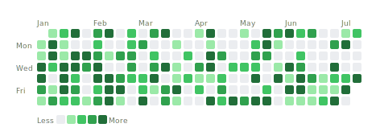

# Quilt

[](https://github.com/ctkrug/habit-heatmap/actions/workflows/ci.yml)
[](LICENSE)
[](https://www.python.org/)

**Any CSV, stitched into a year of squares.** Quilt turns a spreadsheet of dated
events into the GitHub contribution grid you already know how to read: one command,
one SVG (or PNG), no account, no server.

> The tool installs as the `habit-heatmap` CLI and Python package.

```
habit-heatmap workouts.csv -o heatmap.svg --value-col minutes --label "Workout minutes"
```



## Who it's for

You track a habit in a spreadsheet: gym sessions, meditation minutes, pages read,
mood, sleep, days sober. GitHub's contribution graph is the perfect picture of "did
I show up," but it only ever draws your commits. Quilt points that exact grid at your
own CSV, so your streaks look as legible as your green squares at work.

It also drops straight into a dashboard, blog post, or README when you want one
heatmap without pulling in a charting library.

## What you get

- **Any date column becomes a grid.** Point Quilt at your date column and, if you
  want intensity, a numeric column to sum per day. Rows are counted or totaled per
  calendar day automatically.
- **Reads real-world exports.** Bare dates, `YYYY/MM/DD`, `MM/DD/YYYY`, and full ISO
  8601 timestamps all parse without configuration. A `--tz` flag rebuckets UTC
  timestamps into your own day boundaries before counting.
- **SVG by default, PNG on request.** The SVG path has zero dependencies and embeds
  straight into Markdown or a web page. Ask for a `.png` and Quilt rasterizes it
  through the optional `png` extra.
- **Five built-in themes.** `github`, `blue`, `purple`, `mono` for print, and `dark`
  for embedding on a dark page. A theme is a five-color tuple, so adding your own is
  one line.
- **A real Python library, not just a CLI.** `load_events` and `render_svg` are the
  public API; the command line is a thin wrapper. Feed it a CSV, stdin, or an
  iterable of rows straight from a database query.
- **Reads like the reference.** Month labels across the top, Mon/Wed/Fri down the
  side, a "Less ... More" legend below, and a hover tooltip on every day.

## Install

Quilt runs on Python 3.9 or newer. Install it straight from GitHub:

```
pip install "git+https://github.com/ctkrug/habit-heatmap.git"
```

For PNG output, add the `png` extra (it pulls in `cairosvg`):

```
pip install "habit-heatmap[png] @ git+https://github.com/ctkrug/habit-heatmap.git"
```

## Usage

```
habit-heatmap events.csv -o heatmap.svg \
  --date-col date \
  --value-col minutes \
  --theme blue \
  --label "Workouts"
```

As a library:

```python
from habit_heatmap import load_events, render_svg

counts = load_events("events.csv", value_col="minutes")
svg = render_svg(counts, theme="blue", label="Workouts")
```

Pipe data in or out. A `-` means stdin for the CSV argument and stdout for `-o`:

```
cat workouts.csv | habit-heatmap - -o heatmap.svg
habit-heatmap workouts.csv -o - | display
```

Already have the data in Python? Skip the file entirely:

```python
from habit_heatmap import load_events_from_rows

# rows can come from anywhere: a DB cursor, an API response, a generator
counts = load_events_from_rows(db.query("SELECT logged_at AS date, minutes FROM sets"))
```

### Themes

Built in: `github`, `blue`, `purple`, `mono` (grayscale), and `dark` (for a dark-mode
page). See [`docs/GALLERY.md`](docs/GALLERY.md) for all five rendered against the same
data. To add your own, register a five-color tuple, lightest (no activity) to darkest
(busiest):

```python
from habit_heatmap.colors import THEMES

THEMES["sunset"] = ("#fff5eb", "#fdbe85", "#fd8d3c", "#e6550d", "#a63603")
```

Then pass `theme="sunset"` to `render_svg` or `--theme sunset` on the CLI.

### CLI flags

| Flag | Purpose |
| --- | --- |
| `--date-col NAME` | Date column name (default: `date`) |
| `--value-col NAME` | Numeric column to sum per day (default: count rows) |
| `--date-format FMT` | Explicit `strptime` format for unusual dates |
| `--tz ZONE` | IANA zone (e.g. `America/Chicago`) to rebucket timestamps into |
| `--start` / `--end` | Clip the rendered window to `YYYY-MM-DD` bounds |
| `--theme NAME` | One of the five built-in palettes |
| `--label TEXT` | Title rendered above the grid |
| `--week-start {sunday,monday}` | First weekday of each column (default: `sunday`) |
| `--verbose` | Print the `wrote <path>` confirmation (silent by default) |
| `--version` | Print the installed version and exit |

Run `habit-heatmap --help` for the full list.

## Docs

- [`docs/COOKBOOK.md`](docs/COOKBOOK.md) turns common data into a heatmap: git commit
  history, a habit-app export, a spreadsheet time log.
- [`docs/GALLERY.md`](docs/GALLERY.md) shows every theme side by side.
- [`docs/VISION.md`](docs/VISION.md) explains the design decisions.
- [`docs/ARCHITECTURE.md`](docs/ARCHITECTURE.md) maps the code for contributors.

## Stack

Pure Python for the core: the CSV parser and SVG renderer have no runtime
dependencies. PNG export is an opt-in extra backed by `cairosvg`.

## License

MIT. See [`LICENSE`](LICENSE).

---

More of Charlie's projects → https://apps.charliekrug.com
